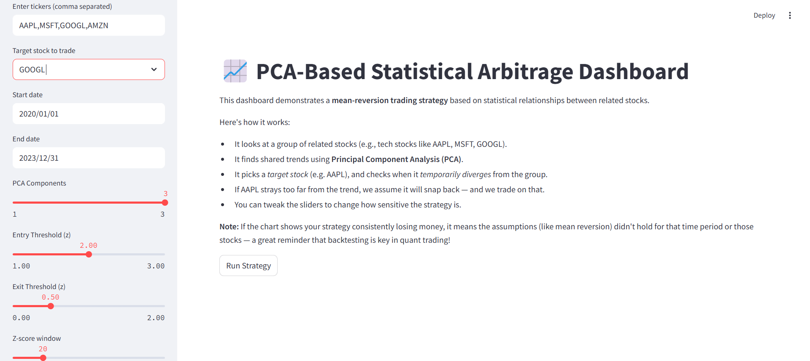
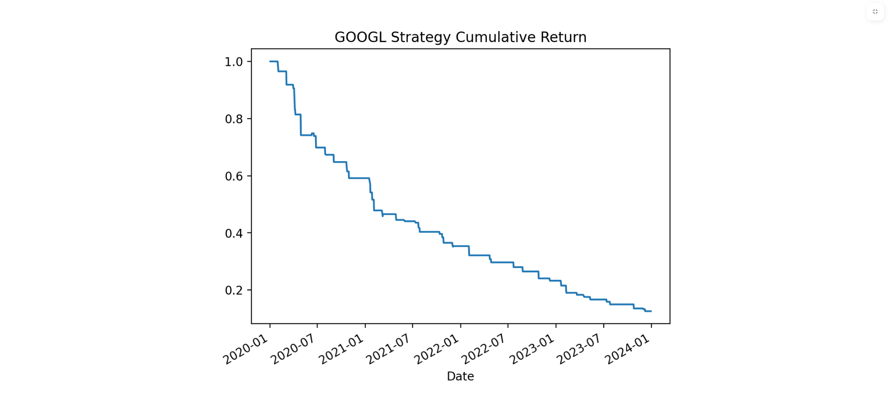
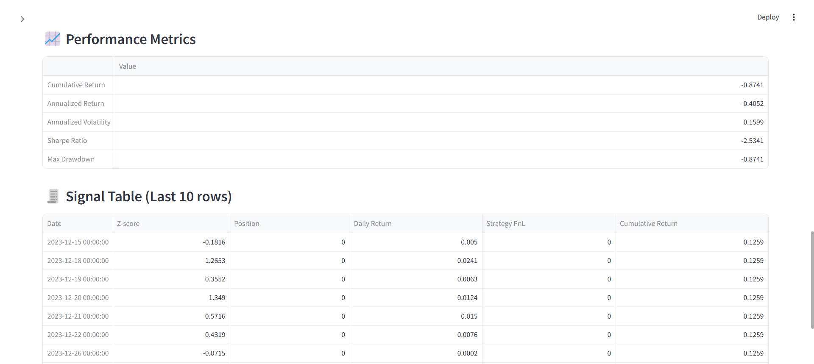

# 📈 PCA-Based Statistical Arbitrage

This project explores a trading strategy that looks for **temporary mispricings in related stocks** and profits when prices return to normal. 

---

## What This Project Does

### 1. Finds Groups of Stocks That Move Together  
I have analyzed stocks from similar sectors to find shared movement patterns.  
(*Uses PCA – Principal Component Analysis – to reduce correlated stock returns into independent factors.*)

### 2. Spots When One Stock Breaks Away from the Group  
When a stock drifts too far from the group’s trend, it might be mispriced — and I try to profit from that.  
(*Regress each stock’s return on the PCA components and measure the difference – the residual – as a signal.*)

### 3. Triggers Buy/Sell Signals Based on That Deviation  
If the deviation is big, I take a position expecting it to return to normal.  
(*We use Z-score thresholds for mean reversion trading signals.*)

### 4. Tests How Well the Strategy Would Have Worked  
We simulate past trades and calculate profits, risk, and performance.  
(*Includes a backtester and metrics like Sharpe ratio, drawdown, and PnL curve.*)

### 5. Shows Results in an Interactive Web Dashboard  
You can tweak inputs and instantly see how the strategy changes.  
(*Built using Streamlit for live visualization and interactivity.*)

---

## 🚀 Try it Live

> 🔗 Streamlit link coming soon.

---

## 🧱 Tech Stack

- Python (main language)
- Streamlit (dashboard UI)
- yFinance (stock data)
- scikit-learn / statsmodels (math & stats)
- pandas / numpy (data handling)
- matplotlib / seaborn (plots)

---

## 📸 Dashboard Previews

Below are live examples from the interactive Streamlit dashboard included in this project:

---

### 🧠 Strategy Setup Interface

Users can enter a set of related tickers (e.g., AAPL, MSFT, GOOGL), choose one to trade, and customize model parameters like PCA components, z-score thresholds, and rolling window size.

---

### 📉 Poor Performance Example

This example shows the backtest of a mean-reversion strategy on AAPL. The strategy consistently underperformed, highlighting that PCA-based arbitrage can break down under certain market regimes. The y-axis represent the value of the investment if we started off at $1

---

### 📊 Backtest Metrics and Trade Signal Log

Includes key metrics such as:
- Cumulative Return
- Annualized Return & Volatility
- Sharpe Ratio
- Max Drawdown

These help you evaluate signal quality, risk, and potential profitability.

The signal table gives a detailed view of the z-score, trade signal, and PnL across time — perfect for debugging or analyzing strategy behavior.

---

## 🌐 Try It Live (via Streamlit Cloud)

> [📲 Launch Dashboard](https://Kairav828-pca-stat-arb.streamlit.app)  

Anyone with the link can:
- Enter their own ticker sets
- Tune parameters
- See live strategy outcomes

---

## 📬 Feedback and Suggestions

Feel free to fork, clone, or contribute! Pull requests welcome.
